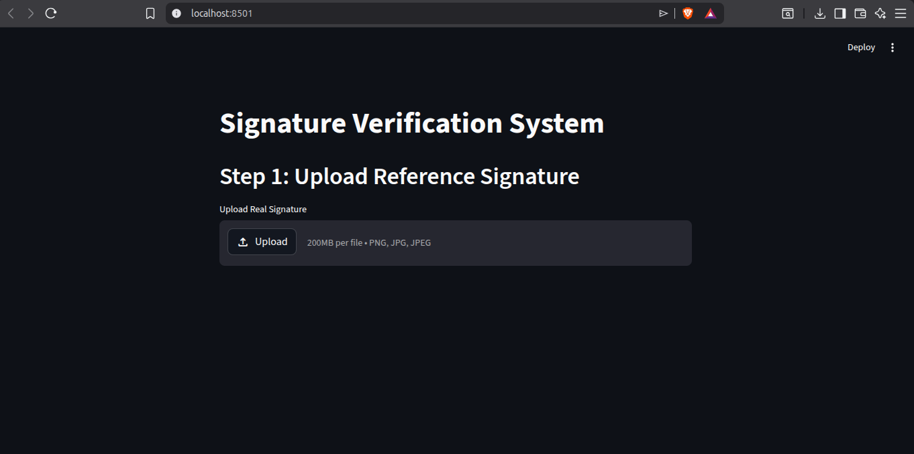
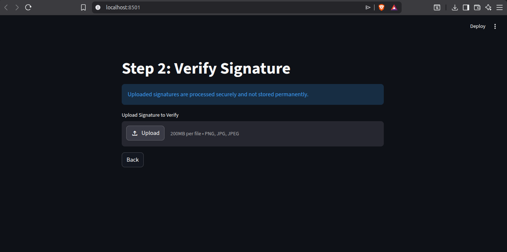
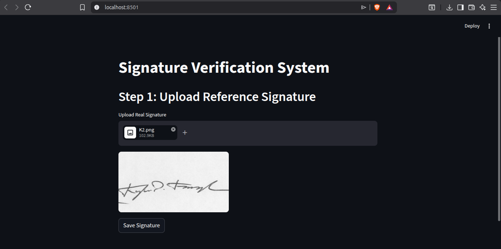
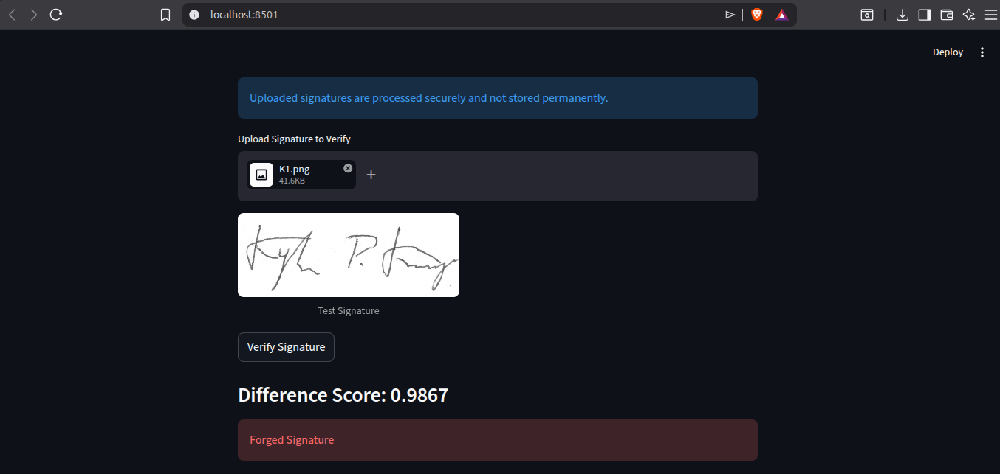
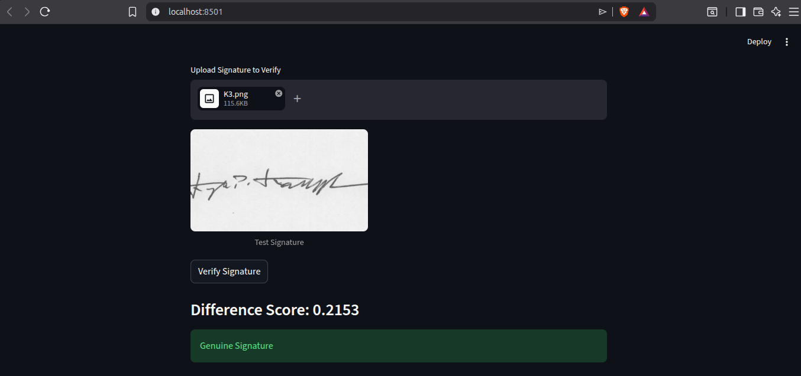

# Signature-Verifivation Web Application

This Project focuses on Verify the the Signature of the any person using deep learning architecure like EfiicentNetB0 with Siamese Network.

## Features
- Upload the Actual Signature of the Person
- Upload the Signature which will be checked
- Model Predicts that the Signature is Genuine or Forged

## Installation
1. Clone the Repo:
    git clone https://github.com/yourusername/project-name.git
2. Go into Directory :
    cd "Signature Verificatio"
3. Create Virtual Environment :
    python3 -m venv venv
4. Activate venv
    source venv/bin/activate
5. Install all required package:
    pip install streamlit numpy tensorflow pillow opencv-python matplotlib
6.  Run the Website:
    streamlit cache clear
    streamlit run app.py

    
## Discussion 
Our aim in this project is to build a web application that takes a person’s signature as input and verifies whether it is genuine or forged. We implemented a Siamese network based on EfficientNetB0 for signature verification.

Initially, the model suffered from overfitting. After applying data augmentation, we achieved strong performance on the test dataset, reaching an accuracy of around 97%. However, achieving true generalization remains an open challenge.

From our observations, the main issue does not lie in the website or the training pipeline, but in the dataset itself. The current dataset lacks sufficient diversity and real-world variation. For a model to generalize well, it requires a large and diverse dataset that captures differences in writing styles, pen pressure, scanning conditions, and noise.

We also attempted to preprocess real-world signature inputs to match the dataset format, but the model still struggles to perform reliably on unseen, real-world signatures. While the model performs well on test data, it fails when we upload new signatures outside the dataset distribution.

Based on our understanding, cross-dataset training or incorporating multiple datasets may help improve generalization. This remains an open problem in our project.

We are students currently learning deep learning and machine learning, and we welcome contributions or suggestions to improve this work. Any help or collaboration would be greatly appreciated. 

## Results

## AppLication InterFace

#Dataset Detail 
CEDAR DATASET Kaggle

#Tech Stack
python3

    
    

